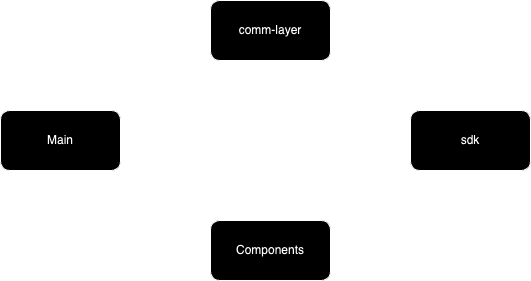
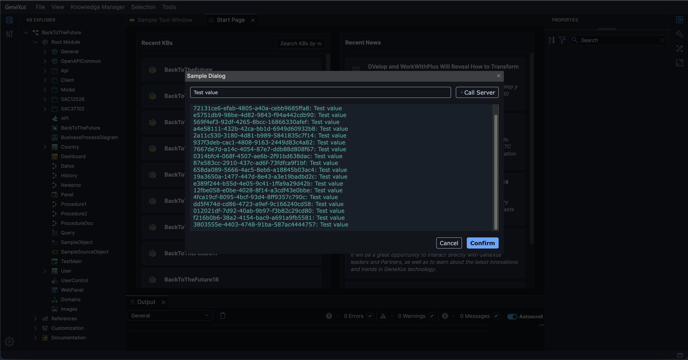

## Frontend

The frontend is responsible for implementing the user interface and interactions of the plugin. This includes defining new UI components, custom objects, parts, tool windows, dialogs, commands, and more. These contributions extend the IDE, enabling the functionality required by the plugin on the frontend side.

The project is organized as a monorepo using JavaScript/TypeScript packages. We rely on **Yarn** as our package manager. Additionally, **Lerna** is used to manage the monorepo, allowing us to streamline development across multiple packages, synchronize changes, and handle shared dependencies efficiently.

## Packages

The frontend consists of several packages, each with a specific responsibility:

- **comm-layer**: Implements the communication layer of the plugin. It facilitates interaction with the service layer found in the backend.
- **components**: Contains the implementation of new user interface components, specifically as web components. For this project, we use **Stencil.js** to create reusable and framework-agnostic components.
- **main**: Defines the contributions made by the plugin. This includes the declaration of new objects and parts, tool windows, dialogs, commands, and other elements that enhance the IDE.
- **sdk**: Provides the IDE SDK, enabling integration and development of plugin functionalities.

To understand the relationship between these packages before introducing new concepts, refer to the following diagram:



## Dependencies

This project relies on a range of dependencies to support its functionality. Among these, two notable dependencies are:

- **Chameleon Controls Library**: A library of white-label, highly customizable, and reusable web components. This library allows us to build consistent and flexible UI components across the IDE.

- **Mercury**: A design system for GeneXus Next IDE. Mercury provides the foundational design elements and guidelines necessary for creating a cohesive and user-friendly interface within the IDE. This design system also provides styles for Chameleon controls, which we can use for other elements as well.

These highlighted dependencies play a crucial role in ensuring a seamless user experience and efficient development.

Note that these dependencies are peerDependencies because they are managed by the IDE. The IDE ensures that the same versions are used by both the IDE itself and all the plugins. You can declare your own versions, but at runtime, the plugin will use the versions of the dependencies provided by the IDE. The IDE is responsible for maintaining and specifying the actual versions.

## Setup

### Requirements

1.  Yarn package manager. To install Yarn, run:

    ```bash
    npm i -g yarn
    ```

### Build and run

1. Install dependencies:
    
    ```bash
    cd frontend
    yarn
    ```

2. Build all packages:

    ```bash
    yarn build
    ```

3. Run main project

    ```bash
    cd packages/main
    yarn preview
    ```

Executing the preview command from the main project will start a server that exposes the plugin. By default, this server listens on `http://localhost:5200`. To use the plugin from the IDE, we need to inform the IDE about its existence.

In your GeneXus IDE installation, open the configuration file located at `{installation}/lib/frontend/genexusm/config.json` and add the following entry:

```json
"plugins": [
    {
        "id": "@sample-vendor/sample-plugin",
        "name": "PluginSample",
        "description": "Sample Plugin",
        "publisher": "Sample Vendor",
        "publisherUrl": "samplevendor.com",
        "keyWords": [ "sample" ],
        "versions": [{
            "ideVersion": "0.0.1",
            "version": "0.0.1",
            "baseUrl": "http://localhost:5200/",
            "bundle": "main.js"
        }]
    }
]
```
This will let the IDE know that the plugin is available and ready to use.

### Watch mode

To test changes as you make them, you can use the watch mode feature.

To enable watch mode, run the following command in each project you are modifying, as well as in the `main` package:

    ```bash
    yarn watch
    ```

After change, you need to reload GeneXus Next IDE.

## Assets

While you check the contributions content, you'll notice that whenever we need to use an icon in this example, we use the following method:

```javascript
AssetsManager.getIconPath({
    category: 'objects',
    name: 'data-provider'
}, Consts.Assets.VENDOR_ALIAS)
```

This helper (like others exposed by `AssetsManager`) allows us to use Mercury base icons or even custom icons generated by our tool, `@genexus/svg-sass-generator`, directly with the Chameleon controls. You can see how it works by checking the icon definitions [here](./packages/components/src/icons/).

In this case, `getIconPath` can accept an object specifying the icon category, icon name, and optionally, the icon color. It also accepts a vendor alias. For this example, we are using "Sample Vendor" as the vendor and "SV" as the sample vendor alias. As a result, you’ll notice that we prefix components with "sv" and retrieve icons using that prefix.

## Contributions

In this section you can find a detailed explanation of this plugin contributions.

### Sample Tool Window

This tool window serves as an example of a minimal object selector, demonstrating how grids, combo boxes, and trees work, as well as how to make the GeneXus IDE interact with our new web component implementation (the [`object-selector`](./packages/components/src/components/object-selector/object-selector.tsx) component).

To begin, you’ll notice that the `object-selector` component has several key properties:
- **objectTypes**: Initializes the set of available object types.
- **loadObjectsCallback**: Fetches and returns objects filtered by type.
- **openObjectCallback**: Opens the specified object.
- **contextMenuCallback**: Displays the context menu.
- **selectObjectCallback**: Manages object selection. In this case, it updates the selected object's context, which is then reflected in the property grid and updated to display the object's properties.

These callback functions are implemented in the tool window and consumed by the web component. By inspecting the `object-selector` code, you can find how the combo box, grid, and tree are related to these callback executions. Also, you can refer to the `chameleon-controls-library` documentation if you want a deeper understanding of these controls.

To support multiple languages, the object selector includes a set of JSON files named `{component-name}.lang.{lang}.json`. These JSON files define translatable strings that can be used by the web components. Translations are fetched at runtime based on the IDE's language settings.

From the IDE contribution side, the sample tool window is defined [here](./packages/main/src/tool-windows/sample-tool-window.tsx). As you can see, the tool window extends the `AbstractToolWindow` class, which provides basic functionalities for a tool window. In our concrete implementation, we can override these basic functions.

You’ll notice that we’ve defined a `render` method. This method returns an 'instance' of the `object-selector` component, assigning the corresponding property values for the properties we mentioned earlier. Here we can highlight the following:

- **objectTypes**: Loaded from the `KBObjectDescriptor` class, which provides all the available KB object descriptors.
- **loadObjectsCallback**: Depending on the filter value, we use different methods available in `KBModel.objects`. `KBModel` represents a model and provides access to various properties and methods that help define our interaction and modeling contributions.
- **openObjectCallback**: Fetches the `KBObject` instance by its identifier and uses the documentation manager (available through our `UIServices`) to open the `KBObject`.
- **contextMenuCallback**: Opens the host (IDE) context menu at the given coordinates and contextualizes it for the selected object. The context menu needs a menu path to determine which commands to show. To support this function, we need to define both the context menu path and the available commands. In this case, we define the [SAMPLE_TOOLWINDOW_MENU](./packages/main/src/contributions/bind-menus.ts) and the [SAMPLE_OPEN_OBJECT](./packages/main/src/contributions/bind-commands.ts) command.
- **selectObjectsCallback**: Updates the selected objects in the tool window context. Various IDE elements, such as the Property Grid, track these selection changes.

Another thing to note about this tool window is that if you open it without an active knowledge base, the tool window will be empty. You can see in the render method that we don’t render anything except an empty div if there is no current knowledge base. This tool window is subscribed to currentKBChanged and only renders its content when a knowledge base is open.

#### Preview


### Sample Dialog

Just like we created the `object-selector` component, we also developed the [`echo-console`](./packages/components/src/components/echo-console/echo-console.tsx) component. In this component, the user can type text and click the 'Call Server' button. This action triggers a callback implemented by the `Sample Dialog`. This callback returns a string, which is the result of concatenating a GUID with the user’s text input. 

Additionally, this dialog provides Cancel and Confirm buttons. The `echo-console` component has the following properties:

- **cancelCallback**
- **confirmCallback**
- **callToServerCallback**

From the IDE contribution side, we have the [`Sample Dialog`](./packages/main/src/dialogs/sample-dialog.tsx). This dialog extends the `WindowForm` class, which provides common dialog functionalities (such as 'show as modal'). The dialog is triggered by the [Plugin Sample Command](./packages/main/src/contributions/bind-commands.ts), where you can see how the dialog results are managed.

- **cancelCallback**: Calls the `onCancel` method provided by the `WindowForm` class. Closes the dialog with a 'cancel' result.
- **confirmCallback**: Calls the `onConfirm` method provided by the `WindowForm` class. Closes the dialog with an 'ok' result.
- **callToServerCallback**: Calls the echo service defined in the communication layer, which communicates with the server. The server implements this service and returns a new GUID instance concatenated with the given text input.

#### Preview



### Sample Object

In the backend documentation, you can see that we defined two new objects: `SampleObject` and `SampleSourceObject`. On the frontend, we need to declare these objects and their parts, and we also need to bind them with the existing editors (or new editors).

To start, we will focus on [`SampleObject`](./packages/main/src/objects/sample-object.ts).  
`SampleObject` is composed of the following parts:

- **SampleStructPart**: Maintains a basic structure of `SampleStructPartItems`. Each item has the following properties: `Name`, `Description`, and `KBObjectName`.
- **Variables**: The well-known variables part, which allows defining variables. We don't need to do anything about this part because it is defined by GeneXus IDE by default.
- **Documentation**: The documentation part, like the previous case, is defined by GeneXus IDE by default, so there's no need to declare anything.

We want to edit the [`SampleStructPart`](./packages/main/src/parts/sample-struct-part.ts) in two ways:
- With a text editor.
- With a struct editor.

In the backend documentation, we can see that on the server side, we added the `MultiRegionSourcePart`. This part allows us to edit the parts specified as region providers (server-side) as a text region. The `VariablesPart` is a region provider, and `SampleSourcePart` was also defined as a region provider. Since the IDE recognizes (by its core implementation) the `MultiRegionSourcePart`, the object part will be editable using the `MultiRegionSourcePartEditor`. Based on how we defined the region provider in the backend, the region for this part will be the default region.

In the following image, you can see how it looks:


You can also see that we have an outliner, whose selection is updated according to the text editor selection (and vice versa). Note that the text belonging to the `SampleStructPart` has its corresponding nodes, with icon and text. This is defined as a contribution, which you can check [here](./packages/main/src/contributions/source-editor-contribution.ts).

Finally, you can also see that the default region has syntax coloring, which is another contribution that you can check [here](./packages/main/src/contributions/grammars-provider.ts).

When it comes to editing as a structure, we also have an implementation of `StructEditor`, which can be easily extended to work with any object part (or other kinds of elements). To enable this editing mode, the [`SampleStructPart`](./packages/main/src/parts/sample-struct-part.ts) extends the `StructPart` class, which provides the basic logic and helpers to allow editors to edit it as a structure. 

We also implemented the [`SampleStructPartEditor`](./packages/main/src/editors/sample-struct-part-editor.tsx). This editor extends the base `StructPartEditor` and defines the visible columns, the different item types, how items are loaded into the editor, the basic logic for creation and deletion, etc.


#### About binding

Once we have defined our objects, parts, and editors, we also need to declare the bindings for each of these elements. You can find the bindings for objects and parts [here](./packages/main/src/contributions/bind-types.ts). For the editors, you can check the bindings [here](./packages/main/src/contributions/bind-part-editors.ts).

### Sample Source Object

As mentioned earlier, we also created the [`SampleSourceObject`](./packages/main/src/objects/sample-source-object.ts). This object is composed of the following parts:

- **SampleSourcePart**: A simple source part that only stores and retrieves text.
- **Documentation**

For this case, we only want to edit the `SampleSourcePart` using a simple text editor. Since `SampleSourcePart` is just a `SourcePart` and doesn't have any additional structure or logic, we [bind](./packages/main/src/contributions/bind-types.ts) the part identifier to the base `SourcePart` exposed by the SDK. We follow the same approach for the editor by [using the SourcePartEditor](./packages/main/src/contributions/bind-part-editors.ts) exposed by the SDK.

### Customize Pattern Editor

To customize how we edit or display pattern instances, we can [bind a custom `PatternHelperDescriptor`](./packages/main/src/contributions/bind-pattern-helpers.ts). In that file, you will see how we assign new [WorkWithWebEditorHelper](./packages/main/src/editors/ww-web-pattern/work-with-web-editor-helper.ts) and [WorkWithWebSettingsEditorHelper](./packages/main/src/editors/ww-web-pattern/work-with-web-settings-editor-helper.ts). These helpers enable us to customize pattern instance elements and create custom editors. In this example, we return an instance of our common `PatternTreeEditor`, but you can use your own custom editor. Note that you can even replace the base editor with your custom implementation.