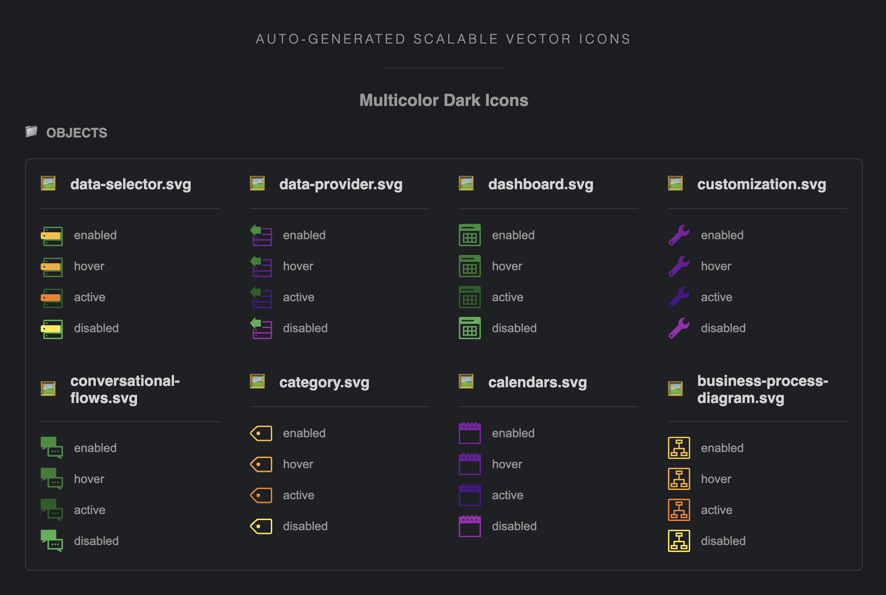

# svg-sass-generator

- [What this tool is about](#what-this-tool-is-about)
- [Using this tool](#using-this-tool)
- [This example](#this-example)

---

## What this tool is about

SVG Sass Generator is a node tool that facilitates the use of svg multicolor or monochrome images, that can be updated for the four states: `:enabled`, `:hover`, `:active`, and `:disabled`, for dark and light color schemes, by using a single image. Although you could technically use this tool for any image, it was created for icons. In the following descriptions, we will refer to the images as _icons_.

> **Illustrative Categories:** The tool can process two types of icons: monochrome, and multicolor. In the following examples, we will refer to "navigation" and "menus" as a monochrome icons categories, and "objects" as a multicolor icons category.

## How it works

You have to provide the source svg icons, and a configuration file with the information about the colors the icons will apply. Then you have to run two scripts provided by the tool with some required parameters. We suggest you to organize your icons by categories, such as `/navigation`, `/menus`, `/status`, and so on. After running this script you will have, for each category:

- [Colored Svg Icons](#colored-svg-icons)
- [Sass Files](#sass-files)
- [A Showcase Page](#showcase-page)
- [An Icons Object](#icons-object)
- [A Log File](#log-file)

### <span style="font-size: 22px;" id="colored-svg-icons">• Colored Svg Icons</span>

For every category, the tool will generate in the **output svg** directory, a new folder with the same name. Inside, you will find a `/light` and a `/dark` folder, with the colored icons for the respective color schemes. ie.:

- `/generated-svg/navigation/dark/*.svg`
- `/generated-svg/navigation/light/*.svg`
- `/generated-svg/objects/dark/*.svg`
- `/generated-svg/objects/light/*.svg`

### <span style="font-size: 22px;" id="sass-files">• Sass Files</span>

For every category, the tool will generate in the **output sass** directory some useful `.sass` files:

**Custom Properties**
These files contain for every icon of the category, a custom property (css variable) for each of the four states (`:enabled`, `:hover`, `:active`, or `:disabled`). ie.:

- `monochrome/navigation__variables.css`
  - `--icon__navigation_arrow-up_gray--enabled`
  - `--icon__navigation_arrow-up_gray--hover`
  - `--icon__navigation_arrow-up_gray--active`
  - `--icon__navigation_arrow-up_gray--disabled`</br></br>
- `multicolor/objects__variables.css`
  - `--icon__objects_api--enabled`
  - `--icon__objects_api--hover`
  - `--icon__objects_api--active`
  - `--icon__objects_api--disabled`</br>

**Placeholders**
These files contain for every icon of the category, a sass virtual selector, that you can invoke in any sass file. The result will be a custom property named `--icon-path` which value will correspond to an icon specific state (`:enabled`, `:hover`, `:active`, or `:disabled`). ie.:

- `monochrome/navigation__placeholders.scss`

```scss
%icon__navigation_arrow-up_gray--enabled {
  --icon-path: var(--icon__navigation_arrow-up_gray--enabled);
}
%icon__navigation_arrow-up_gray--hover {
  --icon-path: var(--icon__navigation_arrow-up_gray--enabled);
}
%icon__navigation_arrow-up_gray--active {
  --icon-path: var(--icon__navigation_arrow-up_gray--enabled);
}
%icon__navigation_arrow-up_gray--disabled {
  --icon-path: var(--icon__navigation_arrow-up_gray--enabled);
}
```

- `multicolor/objects__placeholders.scss`

```scss
%icon__objects_api--enabled {
  --icon-path: var(--icon__objects_api--enabled);
}
%icon__objects_api--hover {
  --icon-path: var(--icon__objects_api--hover);
}
%icon__objects_api--active {
  --icon-path: var(--icon__objects_api--active);
}
%icon__objects_api--disabled {
  --icon-path: var(--icon__objects_api--disabled);
}
```

Besides the _variables_ and _placeholders_ files for every category, the tool will generate three additional files:

**Categories Variables**
This single file named `categories-variables-imports.scss` contains an `@import` statement for every category _variables_ sass file. ie.:

- `@import "./monochrome/navigation__variables"`;
- `@import "./multicolor/objects__variables"`;

**Categories Virtual Selectors (Placeholders)**
This single file named `categories-placeholders-imports.scss` contains an `@import` statement for every category _virtual selectors_ sass file. ie.:

- `@import "./monochrome/navigation__placeholders"`;
- `@import "./multicolor/objects__placeholders"`;

**Categories Lists**
This single file named `categories-lists.scss`contains:

- A list of all the **monochrome** colors that you defined on the configuration JSON file, as well as which **states** each color implements (monochrome colors do not have to implement all the states, only the `:enabled` state is mandatory). ie.:

```scss
$monochrome-colors: (
  gray: (
    enabled,
    hover,
    active,
    disabled
  ),
  blue: (
    enabled
  )
);
```

- A list of all the **monochrome** categories that you defined on the configuration JSON file, as well as which **colors** each category implements (monochrome categories do not have to implement all the colors). ie.:

```scss
$monochrome-categories: (
  menus: (
    gray
  ),
  navigation: (
    gray blue
  )
);
```

- For every category, a list of icons names, that correspond with the icon filename. ie.:

`$navigation: drag, chevron-up, chevron-right, chevron-left, chevron-down, bullet, arrow-up, arrow-right, arrow-left, arrow-down;`

- A list of all the monochrome lists (a list of lists). ie.:

```scss
$all-monochrome-lists: (
  navigation: $navigation,
  menus: $menus
);
```

- A list of all the multicolor lists (a list of lists). ie.:

```scss
$all-multicolor-lists: (
  objects: $objects,
  // just one in this example
);
```

### <span style="font-size: 22px;" id="showcase-page">• A Showcase Page</span>

After running the `svg` script, the tool will generate a `/showcase/index.html` file, that displays every generated icon and state. This is handy a quick way to check if the icons were processed as expected. ie.:

<p align="center">
  
</p>

### <span style="font-size: 22px;" id="icons-object">• An Icons Object</span>

An icons object with `.ts` extension will be generated, with information for every category icon. This information is required for a tool from [chameleon-controls-library](https://github.com/genexuslabs/chameleon-controls-library) to display the icons using the custom properties provided by the `svg-sass-generator`. ie.:

```ts
export const ICONS_ASSETS = Object.freeze({
  icons: Object.freeze({
    objects: Object.freeze({
      "data-selector": Object.freeze({
        enabled: Object.freeze({
          name: "objects_data-selector--enabled"
        }),
        hover: Object.freeze({
          name: "objects_data-selector--hover"
        }),
        active: Object.freeze({
          name: "objects_data-selector--active"
        }),
        disabled: Object.freeze({
          name: "objects_data-selector--disabled"
        })
      }),
      dashboard: Object.freeze({
        enabled: Object.freeze({
          name: "objects_dashboard--enabled"
        }),
        hover: Object.freeze({
          name: "objects_dashboard--hover"
        }),
        active: Object.freeze({
          name: "objects_dashboard--active"
        }),
        disabled: Object.freeze({
          name: "objects_dashboard--disabled"
        })
      })
      // ... and so on
    })
  })
});
```

### <span style="font-size: 22px;" id="log-file">• A Log File</span>

A log file will be generated every time you run the `svg` script, providing information about the success or failure of the process, as well as some detailed information in case of errors or warnings. ie.:

```
================================================
  62 svg's where successfully processed
================================================
Details:

icon path: src/icons/svg-source/objects/data-selector.svg
color scheme: light

icon path: src/icons/svg-source/objects/data-selector.svg
color scheme: dark

icon path: src/icons/svg-source/objects/data-provider.svg
color scheme: light

... and so on
```

---

## Using this tool

1. [Add svg-sass-generator](#add-svg-sass-generator)
2. [Install](#install-ssg)
3. [Add a script for ssg-svg](#add-ssg-script)
4. [Add a script for ssg-sass](#add-sass-script)
5. [Add JSON configuration file](#add-json-config)
6. [Include monochrome source icons](#include-monochrome-icons)
7. [Include multicolor source icons](#include-multicolor-icons)
8. [Process the svg icons](#process-svg-icons)
9. [Process the sass files](#process-sass-files)

This example contains some sample svg icons, and the required configuration JSON file that the tool requires to work. The following steps apply for this example, but you can copy the scripts and the configuration file and modify it according to your needs.

### <span style="font-size: 22px;" id="add-svg-sass-generator">1. Add `svg-sass-generator` as a `devDependency`. ie.:</span>

```
"devDependencies": {
  "@genexus/svg-sass-generator": ">=1.1.19",
}
```

### <span style="font-size: 22px;" id="install-ssg">2. Install the dependency using the package manager of your choice</span>

```
yarn install
```

### <span style="font-size: 22px;" id="add-ssg-script">3. Add a script for the **svg's** generation `ssg-svg`</span>

```bash
ie.:
"icons-svg": "ssg-svg
--srcDir=src/icons/svg-source/
--outDir=src/icons/generated-svg/
--configFilePath=src/icons/config/color-states.json
--showcaseDir=src/icons/showcase/
--showcaseBaseHref=../generated-svg/
--logDir=src/icons/log/
--objectFilePath=src/icons/ICONS_ASSETS.ts"
```

**explanation:**

`--srcDir=` This is the source directory of your icons.
`--outDir=` This is the output directory for your icons.
`--configFilePath=` This is the file path to the configuration file.
`--showcaseDir=` This is the directory for the showcase html page.
`--showcaseBaseHref=` This is an optional `base` path for the showcase page base tag. It has to resolves to the output icons directory.
`--logDir=`This is the directory for the log file.
`--objectFilePath=`This is the file path for the typescript object file.

### <span style="font-size: 22px;" id="add-sass-script">4. Add a script for the **sass's** files generation `ssg-sass`</span>

```bash
ie.:
"icons-sass": "ssg-sass
--srcDir=src/icons/generated-svg/
--outDir=src/icons/generated-sass/
--configFilePath=src/icons/config/color-states.json
--vendorAlias=-abc"
```

**explanation:**
`--srcDir=` This is the source directory, that is the output directory of the svg process (`src/icons/generated-svg/` in this example).
`--outDir=` This is the output directory for your sass files.
`--configFilePath` This is the same and single configuration file for the tool, that was defined for the `svg` script.
`--vendorAlias` This is a required prefix that helps prevent conflicts with other icons that were generated with this tool. The prefix will be used to prefix every icon custom property. ie.: `--icon-abc__navigation_arrow-up_gray--enabled`.

### <span style="font-size: 22px;" id="add-json-config">5. Add a JSON configuration file</span>

This file should be created in the same path as the `--configFilePath` : `src/icons/config/color-states.json` in this example.

```json
{
  "monochrome": {
    "colors": [
      {
        "name": "gray",
        "states": {
          "enabled": {
            "dark": "#616161",
            "light": "#BDBDBD"
          },
          "hover": {
            "dark": "#424242",
            "light": "#9E9E9E"
          },
          "active": {
            "dark": "#212121",
            "light": "#757575"
          },
          "disabled": {
            "dark": "#E0E0E0",
            "light": "#F5F5F5"
          }
        }
      },
      {
        "name": "blue",
        "states": {
          "enabled": {
            "dark": "#1976D2",
            "light": "#42A5F5"
          },
          "hover": null,
          "active": null,
          "active": null
        }
      }
    ],
    "iconsCategories": [
      {
        "folder": "menus",
        "colors": {
          "red": true,
          "blue": false
        }
      },
      {
        "folder": "navigation",
        "colors": {
          "red": false,
          "blue": true
        }
      }
    ]
  },
  "multicolor": {
    "cssPrefix": "icon-",
    "colors": [
      {
        "cssClass": "green",
        "states": {
          "enabled": {
            "dark": "#388E3C",
            "light": "#66BB6A"
          },
          "hover": {
            "dark": "#2E7D32",
            "light": "#43A047"
          },
          "active": {
            "dark": "#1B5E20",
            "light": "#388E3C"
          },
          "disabled": {
            "dark": "#4CAF50",
            "light": "#C8E6C9"
          }
        }
      },
      {
        "cssClass": "yellow",
        "states": {
          "enabled": {
            "dark": "#FBC02D",
            "light": "#FFEB3B"
          },
          "hover": {
            "dark": "#F9A825",
            "light": "#FDD835"
          },
          "active": {
            "light": "#FBC02D"
          },
          "disabled": {
            "dark": "#FFEB3B",
            "light": "#FFF9C4"
          }
        }
      },
      {
        "cssClass": "purple",
        "states": {
          "enabled": {
            "dark": "#7B1FA2",
            "light": "#AB47BC"
          },
          "hover": {
            "dark": "#6A1B9A",
            "light": "#8E24AA"
          },
          "active": {
            "dark": "#4A148C",
            "light": "#7B1FA2"
          },
          "disabled": {
            "dark": "#9C27B0",
            "light": "#E1BEE7"
          }
        }
      }
    ]
  }
}
```

> **note :** The multicolor `cssPrefix` is how the tool identifies a multicolor icon.

### <span style="font-size: 22px;" id="include-monochrome-icons">6. Include the monochrome source icons </span>

Include a folder for every category, in the path that you defined for the `--srcDir` in the `ssg-svg` script.

```svg
ie.: /svg-source/navigation/arrow-up.svg

<svg xmlns="http://www.w3.org/2000/svg" width="16" height="16" fill="none" viewBox="0 0 16 16">
  <path fill="black" fill-rule="evenodd" d="m8 6 4 3.994H4L8 6Z" clip-rule="evenodd"/>
</svg>
```

> **note :** Don't worry about the `fill` value, as it will be overridden by the color defined on the configuration file.

### <span style="font-size: 22px;" id="include-multicolor-icons">7. Include the multicolor source icons </span>

Include a folder for every category, in the path that you defined for the `--srcDir` in the `ssg-svg` script.

```svg
ie.: /svg-source/objects/api.svg

<svg xmlns="http://www.w3.org/2000/svg" width="16" height="16" viewBox="0 0 16 16">
  <g id="api">
    <path class="icon-green" fill="#CCC" d="M10.88,10.39a1.79,1.79,0,0,0,1..."/>
  </g>
</svg>
```

> **note :** Don't worry about the `fill` value, as it will be overridden by the color defined on the configuration file.

> **note :** Be aware that for the multicolor icon, a class name is required, composed by the `cssPrefix` + `cssClass`. ie.: `icon-green`

### <span style="font-size: 22px;" id="process-svg-icons">8. Process the svg icons </span>

```
yarn icons-svg
```

### <span style="font-size: 22px;" id="process-sass-files">9. Process the sass files </span>

```
yarn icons-sass
```

That's it!

---

## This example

### 📂 `./svg-source`

`/svg-source` directory contains some sample icons that are required for testing this tool.

```
- /svg-source/menus/*.svg
- /svg-source/navigation/*.svg
- /svg-source/objects/*.svg
```

#### categories

- `/menus` and `/navigation` directories contains icons that are intended to be processed as monochrome.
- `/objects` directory contains icons that are intended to be processed as multicolor.

### 📄 `./config/color-states.json`

`color-states.json` is a required configuration file that contains the colors values for monochrome and for multicolor icons. This is a starting template that we recommend you to use for you own icons. Here you can copy a blank state for the configuration file:

```json
{
  "monochrome": {
    "colors": [
      {
        "name": "",
        "states": {
          "enabled": {
            "dark": "",
            "light": ""
          },
          "hover": {
            "dark": "",
            "light": ""
          },
          "active": {
            "dark": "",
            "light": ""
          },
          "disabled": {
            "dark": "",
            "light": ""
          }
        }
      }
    ],
    "iconsCategories": [
      {
        "folder": "",
        "colors": {
          "": true,
          "": false
        }
      }
    ]
  },
  "multicolor": {
    "cssPrefix": "",
    "colors": [
      {
        "cssClass": "",
        "states": {
          "enabled": {
            "dark": "",
            "light": ""
          },
          "hover": {
            "dark": "",
            "light": ""
          },
          "active": {
            "dark": "",
            "light": ""
          },
          "disabled": {
            "dark": "",
            "light": ""
          }
        }
      }
    ]
  }
}
```

---

> **note:** This tool is on the first version. If you encounter any issue, please, kindly open an issue on [genexus/design-systems](https://github.com/genexuslabs/design-systems/issues) by applying the `svg-sass-generator`label. Thank you.
